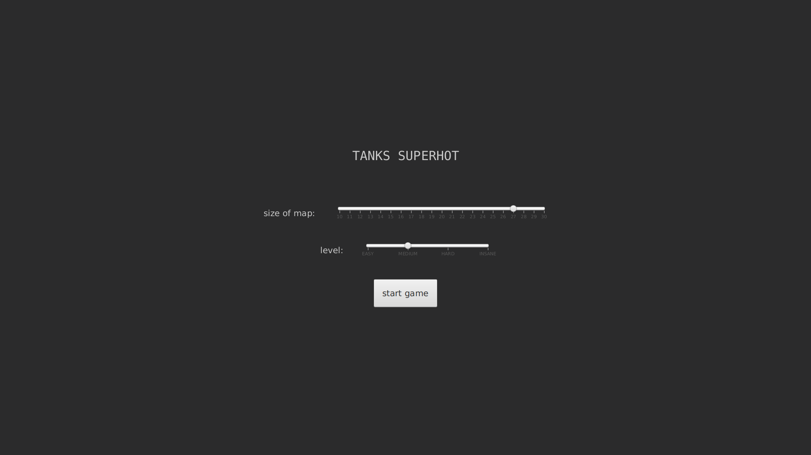
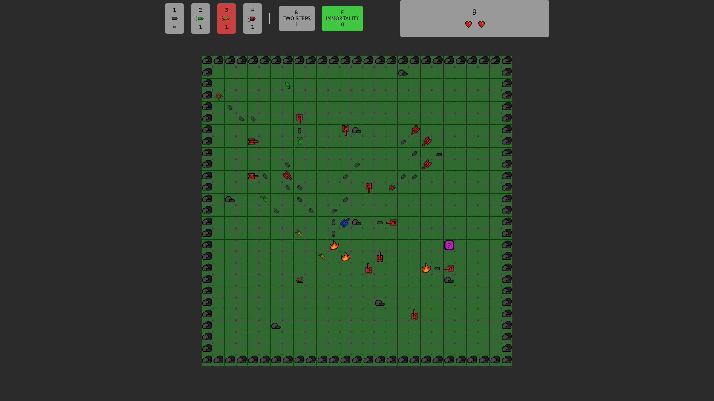
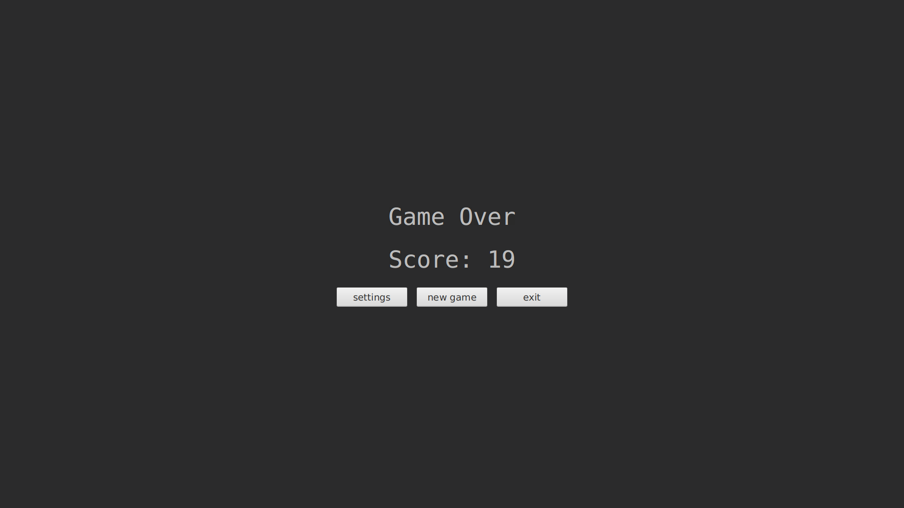

# TANKS SUPERHOT

## Description

This is the second project for the subject Object oriented programming.
The requirements are accessible (in Polish) [under this link](https://github.com/apohllo/obiektowe-lab/blob/master/proj2/Czolgi_Superhot.md).
The project is written in Java v15.0.2. It uses JavaFX library for GUI and Maven for dependencies management.

## How to install?

It is required to have Java in version 15.0.2 installed on your system. The package is available 
[on this site](https://jdk.java.net/15/). It can be also obtained using command line on Linux 
operating systems. Use [this link](https://www.linuxuprising.com/2020/09/how-to-install-oracle-java-15-on-ubuntu.html)
in order to see the instruction.

Then you will have to have Maven installed. There is an instruction [here](https://maven.apache.org/install.html) 
on how to do this.

In order to check if everything is installed properly, check if:
```shell
java -version
```
returns v15.0.2 or later and check if:
```shell
mvn -version
```
shows v3.6.3 or later.

At least use following command to install dependencies and run the game.
```shell
mvn dependency:resolve
mvn javafx:run
```


## Elements

### Bullets

There are four types of bullets in the game:
1.  – common bullet.
   Takes one point of damage on hit.

2.  – bouncy bullet.
   Behaves as common bullet, but bounces off the obstacles.
   
3.  – fast bullet.
   Moves every second field (and thus harder to predict!)
   
4.  – strong bullet.
   Takes two points of damage. Could be useful for destroying obstacles with one shot.
   

### Tanks

There are two types of tanks:
1.  – That's you!

2.  – This is an enemy tank.
   They could be destroyed with just one shot but be aware of the fact that new ones are ready to appear!


### Obstacles

There are objects in the game that can block your path:
1. 
   – indestructible obstacle (wall).
   
2. 
   – normal obstacle. You will need to take two points of damage in order to destroy it!
   
3. 
   – damaged obstacle.
   
### Fire

 – appears on the field where two bullets collide 
or an enemy tank or obstacle is destroyed.

### PowerUp

 – when you step on the field with this object
you get a random power up

### Hearts

 – can be found in the upper right part of the screen.
They represent how many lives you have left.

## Instruction

### Settings

In the first screen we are able to set the size of the square map (from 10 to 30)
and difficulty level (EASY, MEDIUM, HARD, INSANE). Clicking the button starts the game.

### Keys

- <kbd>W</kbd> or <kbd>↑</kbd> — go up
- <kbd>A</kbd> or <kbd>←</kbd> — go left
- <kbd>S</kbd> or <kbd>↓</kbd> — go down
- <kbd>D</kbd> or <kbd>→</kbd> — got right
- <kbd>C</kbd> — rotate right 45 degrees 
- <kbd>Z</kbd> — rotate left 45 degrees
- <kbd>E</kbd> — next available bullet
- <kbd>Q</kbd> — previous available bullet
- <kbd>1</kbd>, <kbd>2</kbd>, <kbd>3</kbd>, <kbd>4</kbd> — change bullet
- <kbd>F</kbd> — immortality for ten moves
- <kbd>R</kbd> — double move
- <kbd>SPACE</kbd> — shoot

### Game over

The game ends when we lose our last heart. On the game over screen we can:
1. go to settings and play once again
2. play again with the same settings
3. exit the game

## Screenshots





## Demo


https://user-images.githubusercontent.com/56299613/183259773-25e0a653-e827-4f22-8f39-26dfc6d5ca8f.mp4


